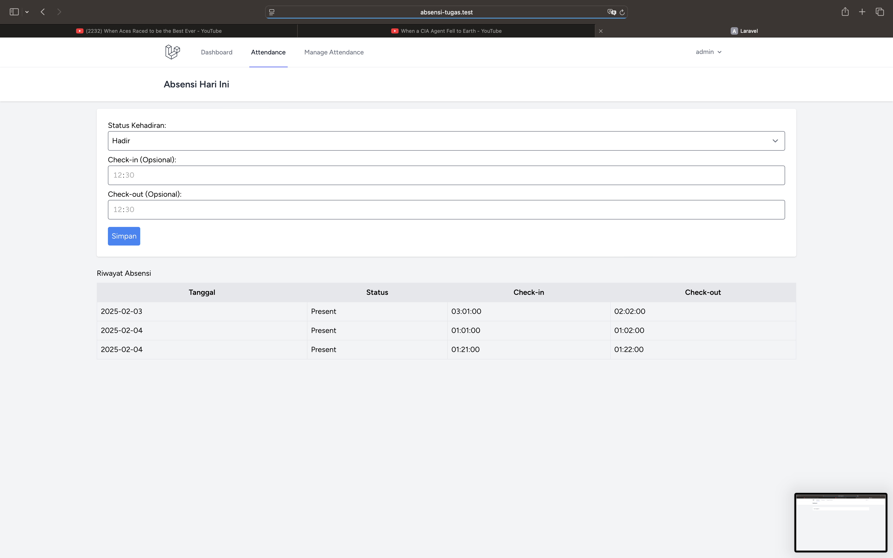

# Attendance Web Application

A web-based attendance application built with Laravel 11 and Laravel Breeze.

## Table of Contents

- [About The Project](#about-the-project)
  - [Built With](#built-with)
- [Demo Screenshots](#demo-screenshots)
- [Getting Started](#getting-started)
  - [Prerequisites](#prerequisites)
  - [Installation](#installation)
- [Usage](#usage)
- [Roadmap](#roadmap)
- [Contributing](#contributing)
- [License](#license)
- [Contact](#contact)
- [Acknowledgments](#acknowledgments)

## About The Project


This is a **web-based attendance system** built using Laravel 11. It allows users to check in/out, and administrators to manage attendance records. The system uses **Laravel Breeze** for authentication and is designed with **Bootstrap** for a modern, responsive UI.

### Built With

This project was built using:

- [Laravel 11](https://laravel.com/)
- [Laravel Breeze](https://laravel.com/docs/11.x/starter-kits#laravel-breeze)
- [MySQL](https://www.mysql.com/)
- [Bootstrap](https://getbootstrap.com/)

## Demo Screenshots

| Feature                | Screenshot |
|------------------------|------------|
| **Login**         |  |
| **Register**         |  |
| **Dashboard**         |  |
| **Attendance**        |  |
| **Edit Attendance (Admin)** |  |
| **List Attendance (Admin)** |  |
| **Profile**           |  |

## Getting Started

Follow these instructions to set up the project locally.

### Prerequisites

Ensure you have the following installed:

- PHP 8.2+
- Composer
- MySQL
- Node.js & npm

### Installation

1. **Clone the Repository**
   ```sh
   git clone https://github.com/yourusername/attendance-app.git
   cd attendance-app
   ```

2. **Install Dependencies**
   ```sh
   composer install
   npm install
   ```

3. **Set Up Environment**
   ```sh
   cp .env.example .env
   ```

   Update `.env` with your database configuration:

   ```
   DB_CONNECTION=mysql
   DB_HOST=127.0.0.1
   DB_PORT=3306
   DB_DATABASE=attendance_db
   DB_USERNAME=root
   DB_PASSWORD=
   ```

4. **Generate Application Key**
   ```sh
   php artisan key:generate
   ```

5. **Run Migrations**
   ```sh
   php artisan migrate --seed
   ```

6. **Build Frontend Assets**
   ```sh
   npm run build
   ```

7. **Run the Application**
   ```sh
   php artisan serve
   ```

   The application will be available at `http://127.0.0.1:8000`.

## Usage

- **Users** can log in and mark attendance.
- **Admins** can view, edit, and manage attendance records.
- **Profile management** allows users to update personal information.

## Roadmap

- [x] User authentication (Laravel Breeze)
- [x] Attendance check-in/check-out
- [x] Admin panel for attendance management
- [ ] Export attendance reports to CSV
- [ ] Integration with fingerprint scanners

## Contributing

Contributions are welcome! To contribute:

1. Fork the project.
2. Create a feature branch (`git checkout -b feature/AmazingFeature`).
3. Commit changes (`git commit -m 'Add some AmazingFeature'`).
4. Push to the branch (`git push origin feature/AmazingFeature`).
5. Open a pull request.

## License

Distributed under the MIT License. See `LICENSE` for more information.

## Contact

- Email: pandjiealdino55@gmail.com
- GitHub: [Xann15](https://github.com/Xann15)

## Acknowledgments

- Laravel Documentation
- Bootstrap UI Kit

---

🚀 This project was built with love by **Pandjie Aldino**! Enjoy using it.
